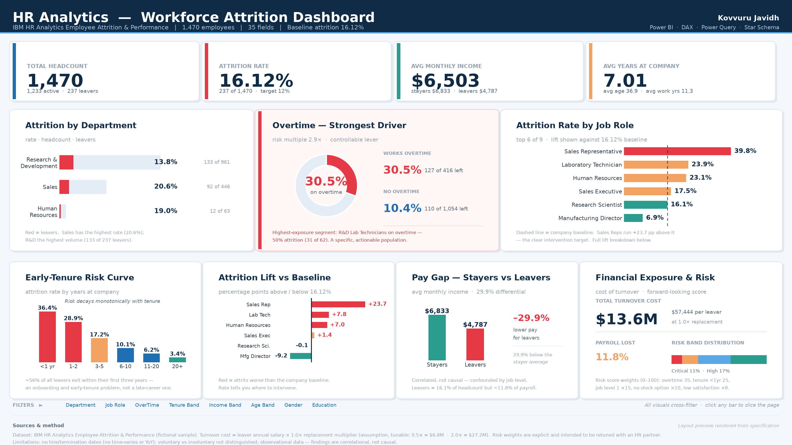

# HR Analytics Dashboard — Workforce Attrition Analysis

An interactive Power BI dashboard analysing **employee attrition across 1,470
employees and 35 fields**, built to answer one business question: *why are 237
people leaving, and what should we fix first?*



*Dashboard layout rendered from the specification in this repo. Build it in
Power BI Desktop using the DAX and Power Query files provided — see
[docs/BUILD_GUIDE.md](docs/BUILD_GUIDE.md).*

---

## Table of Contents

- [The Headline](#the-headline)
- [Five Findings That Matter](#five-findings-that-matter)
- [KPI Framework](#kpi-framework)
- [Repository Structure](#repository-structure)
- [Data Model](#data-model)
- [How to Build It](#how-to-build-it)
- [Documentation](#documentation)
- [Technologies](#technologies)
- [Limitations](#limitations)
- [Author](#author)

---

## The Headline

| KPI | Value |
|---|---|
| **Total Headcount** | **1,470** |
| **Attrition Rate** | **16.12%** (237 leavers) |
| **Overtime Risk Multiple** | **2.9×** (30.5% vs 10.4%) |
| **Avg Monthly Income** | **$6,503** |
| **Avg Years at Company** | **7.01** |
| **Estimated Turnover Cost** | **$13.6M / yr** |

> Attrition is 16.12% and **not evenly distributed**. Three segments —
> employees on **overtime**, staff with **under two years' tenure**, and
> **entry-level role families** — account for the majority of losses. Two of
> the three levers are cheap and fast to pull.

---

## Five Findings That Matter

### 1. Overtime is the dominant — and most actionable — driver

| Segment | Headcount | Leavers | Attrition |
|---|---|---|---|
| Works overtime | 416 | 127 | **30.5%** |
| Does not | 1,054 | 110 | **10.4%** |

A **2.9× risk multiple.** This matters most because overtime is a *scheduling
decision* — it can change next quarter, unlike pay bands or job architecture.

**Critical pocket:** R&D Laboratory Technicians on overtime show **50%
attrition (31 of 62)**.

### 2. This is an early-tenure problem

| Tenure | <1 yr | 1–2 | 3–5 | 6–10 | 11–20 | 20+ |
|---|---|---|---|---|---|---|
| Attrition | **36.4%** | **28.9%** | 17.2% | 10.1% | 6.2% | 3.4% |

Risk falls smoothly and steeply with tenure. **~56% of all leavers exit within
their first three years** — so this is an onboarding problem far more than a
late-career engagement problem.

### 3. Rate vs volume — two different questions

| By rate *(where to intervene)* | Rate | Lift |
|---|---|---|
| Sales Representative | **39.8%** | **+23.7 pp** |
| Laboratory Technician | 23.9% | +7.8 pp |
| Human Resources | 23.1% | +7.0 pp |
| Research Director | 2.5% | −13.6 pp |

| By volume *(where the damage is)* | Leavers | Share |
|---|---|---|
| Research & Development | 133 | 56.1% |
| Sales | 92 | 38.8% |
| Human Resources | 12 | 5.1% |

Sales Reps have the worst *rate* — fix that role. R&D carries the most
*volume* — that's where headcount is bleeding. Optimising one view alone
misallocates the retention budget.

### 4. Compensation structure, not individual pay

| | Avg monthly income |
|---|---|
| Stayers | **$6,833** |
| Leavers | **$4,787** |

Leavers earn **29.9% less** — but role level confounds this. The honest
reading: the organisation is shedding its *cheaper* employees. They are 16.1%
of headcount but only **~11.8% of payroll**.

> **Correlation, not causation.** Claiming causation would require external
> market benchmarks and a controlled comparison.

### 5. Stock options are the second-cheapest lever

| Stock option level | 0 (none) | 1 | 2 | 3 |
|---|---|---|---|---|
| Attrition | **24.4%** | 9.4% | 4.1% | 0.0% |

A **~15-point spread** between level 0 and level 1.

---

## KPI Framework

Six measure groups, **30+ DAX measures**, fully documented in
[docs/KPI_DICTIONARY.md](docs/KPI_DICTIONARY.md):

| Group | Measures | Purpose |
|---|---|---|
| **A. Volume & Workforce** | Headcount, Active, Leavers, Female/Male | Denominators for every rate |
| **B. Attrition KPIs** | Attrition Rate, Retention Rate, First-Year Rate, Leaver Concentration | Headline health |
| **C. Diagnostic Drivers** | Overtime Rate & Multiple, Pay Gap %, Stock Option Rate | *Why* people leave |
| **D. Comparative & Benchmark** | Attrition Lift, RAG Flag, % of Total Leavers, Rank, vs Target | The "so what" |
| **E. Financial** | Turnover Cost, Departing Payroll, % Payroll Lost | Money on the number |
| **F. Risk Scoring** | Attrition Risk Score (0–100), Risk Band, % at Risk | Forward-looking early warning |

### Two design decisions worth knowing

**`DIVIDE` instead of `/`** — when a slicer empties the table, `/` throws
`#DIV/0!` in the middle of a stakeholder demo. `DIVIDE` returns the alternate
value and the card stays clean.

**Percentage points, not percent** — `Attrition Lift` is a *difference* between
two percentages, so it renders as `+23.7 pp`. A small detail that signals
statistical literacy.

### The risk score

```dax
Attrition Risk Score =
VAR WOvertime    = IF ( 'Employees'[OverTime] = "Yes",                35, 0 )
VAR WTenure      = SWITCH ( TRUE (),
                    'Employees'[YearsAtCompany] < 1, 25,
                    'Employees'[YearsAtCompany] < 3, 18,
                    'Employees'[YearsAtCompany] < 6,  8, 0 )
VAR WLevel       = IF ( 'Employees'[JobLevel] = 1,                    15, 0 )
VAR WStock       = IF ( 'Employees'[StockOptionLevel] = 0,            10, 0 )
VAR WSat         = SWITCH ( TRUE (),
                    'Employees'[JobSatisfaction] = "Low",    8,
                    'Employees'[JobSatisfaction] = "Medium", 4, 0 )
VAR WInvolvement = IF ( 'Employees'[JobInvolvement] = "Low",           7, 0 )
RETURN WOvertime + WTenure + WLevel + WStock + WSat + WInvolvement
```

Weights are **explicit and auditable** — max 100, each weight a stated
assumption an HR partner can challenge. The rate measures are backward-looking
(who already left); the score is forward-looking (who is *about* to).

---

## Repository Structure

```
POWER-BI-/
├── README.md                          You are here
├── data/
│   └── HR_Employee_Attrition.csv      Raw dataset — 1,470 rows × 35 columns
├── powerquery/
│   ├── HR_Data_Transformation.m        Flat-model cleaning query
│   └── Star_Schema.m                   Fact + 6 dimension tables
├── dax/
│   └── HR_Dashboard_Measures.dax       30+ measures across 6 groups
└── docs/
    ├── KPI_DICTIONARY.md              Every KPI: formula, value, how to explain it
    ├── EXECUTIVE_SUMMARY.md           Business findings & ranked recommendations
    ├── DATA_DICTIONARY.md             All 35 columns, types, meanings, drops
    ├── INTERVIEW_GUIDE.md             60-second pitch + likely questions & answers
    ├── BUILD_GUIDE.md                 Visual-by-visual build instructions
    ├── dashboard_preview.png          Dashboard layout render
    └── _make_preview.py               Regenerates the preview image
```

---

## Data Model

Star schema rather than a single flat table — for slicer performance, correct
`ALL()` baseline behaviour, and to prevent ambiguous filter paths:

```
DimDepartment ─┐
DimJobRole    ─┤
DimTenureBand ─┼── FactEmployee ── DimDate (when dates are available)
DimIncomeBand ─┤
DimAgeBand    ─┤
DimOvertime   ─┘
```

| Table | Grain | Rows |
|---|---|---|
| `FactEmployee` | one row per employee | 1,470 |
| `DimDepartment` / `DimJobRole` / `DimTenureBand` / `DimIncomeBand` / `DimAgeBand` / `DimOvertime` | one row per member | 3 / 9 / 6 / 5 / 5 / 2 |

All relationships are **single-direction** (dim → fact).

**Cleaning:** 6 columns dropped — `EmployeeCount`, `StandardHours`, `Over18`
(constants, zero variance) and `HourlyRate`, `DailyRate`, `MonthlyRate`
(redundant with `MonthlyIncome`). Kept `PercentSalaryHike`: it measures raise
*magnitude*, a different concept from pay *level*.

**Data-quality gate:** the Power Query ends in a row-count assertion — if the
source ever isn't 1,470 rows, the query **errors loudly** instead of silently
producing wrong KPIs.

---

## How to Build It

Requires [Power BI Desktop](https://powerbi.microsoft.com/desktop/) (free, Windows).

1. **Get data → Text/CSV** → `data/HR_Employee_Attrition.csv` → *Transform Data*
2. **Advanced Editor** → paste `powerquery/HR_Data_Transformation.m` (flat) or
   `powerquery/Star_Schema.m` (dimensional) → *Close & Apply*
3. **New measure** → paste each block from `dax/HR_Dashboard_Measures.dax`
4. Build visuals per [docs/BUILD_GUIDE.md](docs/BUILD_GUIDE.md)
5. **Format → Edit interactions** → enable cross-filtering

Full walkthrough, including field wells, formatting and troubleshooting:
**[docs/BUILD_GUIDE.md](docs/BUILD_GUIDE.md)**

---

## Documentation

| Doc | What it gives you |
|---|---|
| **[KPI_DICTIONARY.md](docs/KPI_DICTIONARY.md)** | Every KPI — definition, DAX, actual value, *and how to explain it* |
| **[EXECUTIVE_SUMMARY.md](docs/EXECUTIVE_SUMMARY.md)** | Stakeholder-ready findings and 6 ranked recommendations with cost/impact |
| **[DATA_DICTIONARY.md](docs/DATA_DICTIONARY.md)** | All 35 columns, ordinal label mappings, dropped columns, star schema, DQ checks |
| **[INTERVIEW_GUIDE.md](docs/INTERVIEW_GUIDE.md)** | 60-second pitch, STAR structure, 10 likely questions with answers, numbers to memorise |
| **[BUILD_GUIDE.md](docs/BUILD_GUIDE.md)** | Step-by-step build with validation checklist and troubleshooting table |

---

## Technologies

- **Power BI Desktop** — data modelling and report authoring
- **Power Query (M)** — cleaning, type casting, banding, star schema, row-count guard
- **DAX** — KPI measures, context transition, `DIVIDE`, `RANKX`, `SWITCH`, risk scoring
- **SQL** — `GROUP BY`, aggregate and conditional logic (companion [HR-Analytics-SQL](https://github.com/kovvurujavidh/HR-Analytics-SQL) repo)
- **Excel** — source analysis (companion [HR-Analytics-Excel-Dashboard](https://github.com/kovvurujavidh/HR-Analytics-Excel-Dashboard) repo)

### Related Projects

| Project | Tool |
|---|---|
| [HR-Analytics-Excel-Dashboard](https://github.com/kovvurujavidh/HR-Analytics-Excel-Dashboard) | Excel, Pivot Tables, Slicers |
| [HR-Analytics-SQL](https://github.com/kovvurujavidh/HR-Analytics-SQL) | MySQL |
| **This repo** | Power BI, DAX, Power Query |

---

## Limitations

Stated openly, because credibility depends on it:

1. **No dates.** There is no hire/termination date column, so genuine
   time-series and YoY trends cannot be computed. A true 12-month annualised
   rate with average headcount as denominator isn't possible from this source.
2. **Voluntary vs involuntary not distinguished.** The dataset only records
   `Attrition = Yes/No`, so regretted-loss analysis isn't possible.
3. **Correlation ≠ causation.** The pay-gap and satisfaction findings are
   associations in observational data with no control group.
4. **Turnover cost is modelled, not measured.** The 1.0× replacement
   multiplier is an explicit, tunable parameter (0.5× → $6.8M, 2.0× → $27.2M).
5. **Risk-score weights are assumptions.** Transparent and intended to be
   retuned with an HR partner.
6. **`PerformanceRating` has no values of 1 or 2.** Everyone is rated Excellent
   or Outstanding — near-zero variance, so it should not be used as a driver.
7. **Synthetic data.** IBM released this as a fictional sample — figures are
   methodologically sound but are not a real company's results.

---

## Author

**Kovvuru Javidh**
Data / MIS Analyst — Excel · SQL · Power BI · Data Visualization

- GitHub: [@kovvurujavidh](https://github.com/kovvurujavidh)
- LinkedIn: [kovvurujavidh](https://www.linkedin.com/in/kovvurujavidh/)
- Portfolio: [localbizz.dpdns.org](https://localbizz.dpdns.org/)

---

## License

Dataset © IBM (fictional sample data, released for educational use). Dashboard
code in this repository is open for learning and reuse.
